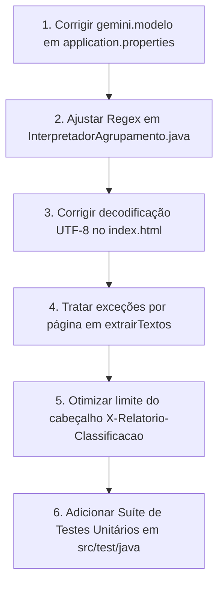

# 🔍 Relatório de Auditoria de Código: Bugs e Melhorias (`pdf-splitter`)

Este relatório apresenta uma análise aprofundada da base de código do projeto **`pdf-splitter`**, uma aplicação **Quarkus 3.39 (Java 21)** projetada para separar PDFs consolidados em categorias via IA (Google Gemini) e heurísticas/palavras-chave.

---

## 📊 Resumo Executivo

| Categoria | Encontrados | Severidade |
| :--- | :---: | :--- |
| **Bugs Críticos & Falhas de Configuração** | 4 | 🔴 Alta |
| **Bugs de Concorrência, Memória e Desempenho** | 4 | 🟠 Média |
| **Erros de Frontend & Usabilidade** | 3 | 🟡 Média/Baixa |
| **Oportunidades de Arquitetura & Testes** | 5 | 🔵 Melhoria |

> [!CAUTION]
> **Achado Crítico Principal**: O nome do modelo Gemini configurado no arquivo `application.properties` é **`gemini-3.5-flash-lite`**, um modelo inexistente na API do Google. Isso faz com que **100% das chamadas de classificação por IA falhem silenciosamente** (após 2 retries e atraso de rede), forçando o sistema a usar sempre o fallback por palavras-chave.

---

## 🔴 1. Bugs Críticos e Falhas de Configuração

### 1.1 Modelo Gemini Inexistente Configurado (`gemini-3.5-flash-lite`)
- **Localização**: [`application.properties#L13`](file:///c:/Users/rafael-ioppi/Nova%20pasta%20%285%29/pdf-splitter/src/main/resources/application.properties#L13) e [`GeminiConfig.java#L12`](file:///c:/Users/rafael-ioppi/Nova%20pasta%20%285%29/pdf-splitter/src/main/java/com/rafael/pdfsplitter/gemini/GeminiConfig.java#L12)
- **Descrição**: O valor padrão do modelo está configurado como `gemini-3.5-flash-lite`. O Google Gemini não possui este modelo (os modelos atuais são `gemini-2.0-flash`, `gemini-1.5-flash`, `gemini-2.0-flash-lite`, etc.).
- **Impacto**: Qualquer requisição que tente usar o Gemini recebe um erro `HTTP 404 Not Found` da API do Google. O serviço realiza retries com `Thread.sleep(400)`, insere latência desnecessária e cai **100% das vezes** no fallback por palavras-chave.
- **Correção Recomendada**: Alterar o modelo em `application.properties` para `gemini-2.0-flash` ou `gemini-1.5-flash`.

```properties
# Correção em application.properties
gemini.modelo=gemini-2.0-flash
```

---

### 1.2 Regex de Agrupamento Invalida Documento ID `0` (`0*` Guloso)
- **Localização**: [`InterpretadorAgrupamento.java#L31`](file:///c:/Users/rafael-ioppi/Nova%20pasta%20%285%29/pdf-splitter/src/main/java/com/rafael/pdfsplitter/gemini/InterpretadorAgrupamento.java#L31)
- **Código Atual**:
  ```java
  private static final Pattern LINHA = Pattern.compile("^\\s*(\\d{1,5})\\s*[|;,\\t]\\s*D?0*(\\d{1,5})\\s*[|;,\\t]\\s*(.+?)\\s*$");
  ```
- **Descrição**: O qualificador `0*` (zero ou mais zeros) é *greedy* (guloso). Se a resposta do Gemini contiver um `docId` igual a `0` (ex: `1|0|TFD_RS`), o trecho `0*` consome o caractere `'0'`. Em seguida, o grupo `(\d{1,5})` exige **pelo menos 1 dígito**, mas não há mais dígitos restantes. O regex falha em fazer o match e a linha é descartada.
- **Impacto**: Perda de classificação para respostas onde a IA inicia os IDs de documento em `0`.
- **Correção Recomendada**: Ajustar o padrão para permitir zero como valor válido de documento ID, usando `(\\d{1,5})`.

---

### 1.3 Estouro de Tamanho no Cabeçalho HTTP `X-Relatorio-Classificacao`
- **Localização**: [`PdfSplitService.java#L52`](file:///c:/Users/rafael-ioppi/Nova%20pasta%20%285%29/pdf-splitter/src/main/java/com/rafael/pdfsplitter/PdfSplitService.java#L52) e [`PdfSplitResource.java#L52`](file:///c:/Users/rafael-ioppi/Nova%20pasta%20%285%29/pdf-splitter/src/main/java/com/rafael/pdfsplitter/PdfSplitResource.java#L52)
- **Descrição**: O limite de páginas no relatório em JSON é `LIMITE_PAGINAS_NO_RELATORIO = 500`. Um relatório JSON com 500 páginas gera ~35 KB de texto. Ao codificar em Base64, a string ultrapassa 46 KB.
- **Impacto**: Servidores web e proxies (como Nginx, Render proxy e Netty) possuem limite padrão para tamanho de cabeçalho HTTP entre **8 KB e 16 KB**. Quando o PDF ultrapassa ~100 páginas, o servidor ou proxy retorna erro `HTTP 431 Request Header Fields Too Large` ou remove o cabeçalho, quebrando o download ou o relatório no frontend.
- **Correção Recomendada**:
  1. Reduzir o limite de detalhamento por página enviado via cabeçalho HTTP para no máximo 80-100 páginas; ou
  2. Enviar o relatório como uma entrada JSON dentro do próprio arquivo `.zip` ou através de uma rota dedicada de consulta.

---

### 1.4 Decodificação Incorreta de UTF-8 Base64 no Frontend
- **Localização**: [`index.html#L626`](file:///c:/Users/rafael-ioppi/Nova%20pasta%20%285%29/pdf-splitter/src/main/resources/META-INF/resources/index.html#L626)
- **Código Atual**:
  ```javascript
  const relatorio = JSON.parse(atob(relatorioBase64));
  ```
- **Descrição**: A função nativa `atob()` no navegador decodifica Base64 para uma string binária (ISO-8859-1). Se o relatório contiver caracteres acentuados em UTF-8 (como palavras-chave ou mensagens em português), o `JSON.parse` pode lançar um `SyntaxError` ou corromper a acentuação dos rótulos na interface.
- **Correção Recomendada**: Utilizar `TextDecoder` para decodificar UTF-8 corretamente:
  ```javascript
  const bytes = Uint8Array.from(atob(relatorioBase64), c => c.charCodeAt(0));
  const relatorio = JSON.parse(new TextDecoder().decode(bytes));
  ```

---

## 🟠 2. Bugs de Concorrência, Memória e Desempenho

### 2.1 Degradação Cumulativa de Qualidade em `comprimirSePreciso`
- **Localização**: [`PdfSplitService.java#L532-L547`](file:///c:/Users/rafael-ioppi/Nova%20pasta%20%285%29/pdf-splitter/src/main/java/com/rafael/pdfsplitter/PdfSplitService.java#L532-L547)
- **Descrição**: No método de compressão de PDFs grandes (ex: `exames.pdf` > 10MB), o código itera sobre o array `QUALIDADES_COMPRESSAO = { 0.6f, 0.4f, 0.25f, 0.15f, 0.08f }`. A cada passo do loop, o `documento` alterado na iteração anterior é reutilizado. Isso re-comprime uma imagem que já sofreu compressão lossy JPEG no passo anterior, acumulando artefatos e gastando ciclos desnecessários de CPU/RAM.
- **Correção**: Recarregar o PDF a partir dos bytes originais para cada nível de qualidade ou aplicar compressão direta proporcional sem re-encodificar sequencialmente a mesma imagem.

---

### 2.2 Risco de Leak de Handles de Arquivo em `Loader.loadPDF`
- **Localização**: [`PdfSplitService.java#L116-L124`](file:///c:/Users/rafael-ioppi/Nova%20pasta%20%285%29/pdf-splitter/src/main/java/com/rafael/pdfsplitter/PdfSplitService.java#L116-L124)
- **Descrição**: O documento `PDDocument origem` é instanciado fora do bloco `try-with-resources`. Se `origem.getNumberOfPages()` ou outro método lançar uma exceção de runtime antes do bloco `try (origem)`, o arquivo PDF temporário não será fechado adequadamente.
- **Correção**: Incluir a chamada `Loader.loadPDF(arquivoPdf)` diretamente na declaração do `try-with-resources`:
  ```java
  try (PDDocument origem = Loader.loadPDF(arquivoPdf)) { ... }
  ```

---

### 2.3 Vulnerabilidade a Páginas Corrompidas em `extrairTextos`
- **Localização**: [`PdfSplitService.java#L172-L183`](file:///c:/Users/rafael-ioppi/Nova%20pasta%20%285%29/pdf-splitter/src/main/java/com/rafael/pdfsplitter/PdfSplitService.java#L172-L183)
- **Descrição**: Se um PDF contiver 100 páginas e apenas 1 página possuir uma fonte/estrutura corrompida, o método `stripper.getText(documento)` lança uma `IOException`, fazendo com que a requisição inteira falhe com erro HTTP 500.
- **Correção**: Envolver a extração de texto de cada página em um bloco `try-catch` individual, registrando um aviso em log e definindo o texto da página corrompida como vazio (`""`), permitindo que as outras 99 páginas sejam processadas normalmente.

---

### 2.4 Alocação Contínua de ThreadPool Fixo em Java 21
- **Localização**: [`PdfSplitService.java#L70`](file:///c:/Users/rafael-ioppi/Nova%20pasta%20%285%29/pdf-splitter/src/main/java/com/rafael/pdfsplitter/PdfSplitService.java#L70)
- **Descrição**: É criado um `Executors.newFixedThreadPool(8)` mantido continuamente na memória da JVM. Como o projeto roda em **Java 21** (`<maven.compiler.release>21</maven.compiler.release>`), o uso de Virtual Threads (`Executors.newVirtualThreadPerTaskExecutor()`) eliminaria o custo fixo de memória de 8 threads de sistema operacional no Render (free tier com 512 MB).

---

## 🟡 3. Erros de Frontend e Usabilidade

1. **Dependência de CDN Externa no Frontend (`index.html`)**:
   - O JSZip é carregado via CDN externa (`https://cdnjs.cloudflare.com/ajax/libs/jszip/3.10.1/jszip.min.js`). Em ambientes sem acesso à internet externa ou caso a CDN sofra oscilação, a renderização do resultado final falha.
2. **Falta de Feedback ao Usuário se a API do Gemini Falhar**:
   - Se a chave do Gemini não estiver configurada ou a cota for excedida, o sistema cai silenciosamente para o modo palavra-chave. O usuário não recebe nenhum alerta claro na interface de que a classificação funcionou apenas por palavra-chave devido a uma falha na API da IA.

---

## 🔵 4. Oportunidades de Arquitetura e Melhoria de Código

### 4.1 Cobertura de Testes Automatizados (Zero Testes Atualmente)
- O diretório `src/test/java` está completamente vazio.
- **Recomendação**: Adicionar testes unitários para:
  - `ClassificadorPalavraChaveServiceTest`: Validar normalização de acentos e regex de borda (`\b`) para termos curtos como "rg" e "cpf".
  - `InterpretadorAgrupamentoTest`: Validar o parsing de respostas do Gemini com vários cenários de formato.
  - `AgrupadorContextualServiceTest`: Validar regras de costura de janelas e regra de segurança do `TFD_RS`.

---

### 4.2 Utilização do Modo JSON Estruturado da API do Gemini
- Atualmente, a chamada ao Gemini exige resposta em texto plano separada por barras (`|`), a qual é parseada com Regex.
- O modelo Gemini suporta `responseMimeType: "application/json"` com schema estruturado. Utilizar JSON nativo torna o contrato 100% determinístico e à prova de falhas de formatação de texto.

---

### 4.3 Depreciação no `pom.xml`
- **Aviso do Maven**: `[WARNING] The artifact io.quarkus:quarkus-junit5:jar:3.39.3 has been relocated to io.quarkus:quarkus-junit:jar:3.39.3`.
- **Ação**: Atualizar o `artifactId` no `pom.xml` de `quarkus-junit5` para `quarkus-junit`.

---

## 🚀 Roteiro Recomendado de Correções



---
*Relatório gerado automaticamente após inspeção completa do código-fonte do projeto.*

